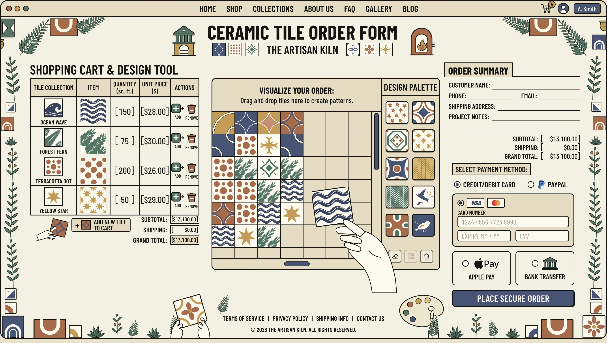
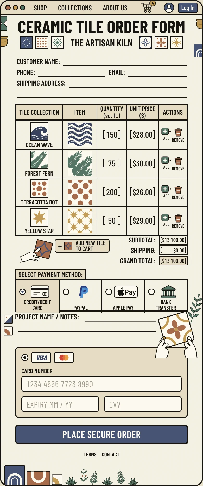

# The Artisan Kiln — форма заказа керамической плитки

Реализация [тестового задания](https://gitlab.com/tile-expert-test-tasks/frontend): одностраничная форма заказа плитки с корзиной, визуализатором раскладки 7×7 и оформлением заказа. Мобильная и десктопная версии свёрстаны по макетам.

|                    Desktop (1376 px)                    |                    Mobile (390 px)                    |
| :-----------------------------------------------------: | :---------------------------------------------------: |
|  |  |

## Быстрый старт

Нужен Node.js 20.9+.

```bash
npm install
npm run dev        # http://localhost:3000
```

| Команда                      | Что делает                                   |
| ---------------------------- | -------------------------------------------- |
| `npm test`                   | unit- и компонентные тесты (Vitest)          |
| `npm run lint`               | ESLint (`next/core-web-vitals` + TypeScript) |
| `npm run typecheck`          | `tsc --noEmit`                               |
| `npm run build && npm start` | продакшен-сборка (страница статическая)      |
| `npm run format`             | Prettier + сортировка классов Tailwind       |

## Стек

- **Next.js 16** (App Router, Turbopack), **React 19**, **TypeScript** (strict)
- **Tailwind CSS 4.** Все цвета, шрифты, тени и брейкпоинты лежат в [`tailwind.config.js`](tailwind.config.js), он подключён через `@config` в `globals.css`
- **Redux Toolkit 2**: `createSlice`, `createEntityAdapter`, `createSelector`, `createAsyncThunk`, `combineSlices`
- **framer-motion** для анимаций, **@dnd-kit/core** для drag & drop
- **Vitest + Testing Library**, **ESLint**, **Prettier**

## Что сделано

### Вёрстка и адаптив

- Десктоп сверен с макетом 1376×768 наложением скриншота на макет. Колонки (384 / 520 / 308 px), таблица, визуализатор, палитра, блок оплаты и подвал совпадают с точностью до нескольких пикселей.
- Мобильный макет — это экран телефона в 2x (768 px = 384 CSS px). Мобильная версия сверялась на ширине 384 px.
- Брейкпоинты: до 1024 px — мобильная раскладка; 1024–1279 px — две колонки (корзина + визуализатор, итоговый блок под ними); от 1280 px — три колонки, как в макете; от 1440 px страница «окном» лежит на подложке.
- Шрифт — **Barlow Condensed**. Его подбирал сравнением с надписями макета: ширина заголовка 428 px против 431 px в макете.
- Цвета сняты пипеткой с макета (кремовый `#f8f4e4`, песочный `#e8dcc0`, индиго `#445478`, шалфей, терракота, горчица).
- Вся графика — inline SVG: 12 узоров плитки, иконки, ветки, черепки и руки. Она чёткая на ретине и красится токенами из Tailwind-конфига.

### Корзина

- В поле количества можно вводить только цифры (0–9999). Стрелки ↑/↓ меняют значение на ±1, с Shift — на ±10.
- **Add** добавляет 1 кв. фут. **Remove** удаляет строку и показывает тост с **Undo**, который возвращает строку на прежнее место. Фокус переходит к соседней строке.
- **Add new tile to cart** открывает диалог с плитками, которых ещё нет в корзине. Новая строка получает 10 кв. футов, фокус встаёт в её поле количества.
- Subtotal / Shipping / Grand Total считаются мемоизированными селекторами, при изменении цифры анимированно «докручиваются». Есть подсказка «добавьте $X для бесплатной доставки».
- Пустая корзина показывает отдельное состояние со ссылкой «вернуть пример заказа».

### Design Tool (только десктоп)

- Доска 7×7 при старте заполнена узором с макета. В палитре 12 плиток, у каждой счётчик — сколько клеток она занимает.
- **Выбор и размещение:** клик по плитке в палитре делает её «кистью», дальше клик по клеткам. Повторный клик или Esc снимает кисть.
- **Drag & drop:** плитку можно перетащить из палитры в клетку. Уложенную плитку можно перенести (на занятую клетку — меняются местами), а утащить с доски или на палитру — убрать.
- В тулбаре есть ластик, «залить пустые» и «очистить». Правый клик по плитке снимает её.
- Работа с клавиатуры: доска — одна tab-остановка (паттерн ARIA grid). Стрелки, Home и End двигают фокус, Enter/Space применяют инструмент, Delete очищает клетку. Для скринридеров озвучивается перетаскивание.

### Оформление заказа

- **Валидация.** Имя, телефон (7–15 цифр), email и адрес обязательны; заметки — до 500 символов.
- **Проверки карты.** Номер проверяется по длине для платёжной системы и по алгоритму Луна. Срок — формат MM / YY, не истёк и не дальше 20 лет. CVV — 3 цифры, у Amex 4. Поля карты обязательны только при оплате картой.
- Ошибка поля появляется, когда пользователь из него ушёл, или после первой попытки отправки. При отправке фокус переходит на первое невалидное поле, кнопка «вздрагивает».
- **Маски ввода.** Номер карты делится на группы по 4 (Amex — 4-6-5), срок — «MM / YY». Каретка не прыгает в конец при правке в середине. По номеру определяется платёжная система и подсвечивается бейдж VISA / Mastercard.
- **Способы оплаты:** карта / PayPal / Apple Pay / банковский перевод. Это нативная радиогруппа, панель под ней меняется с анимацией.
- **Отправка** — `createAsyncThunk` поверх заглушки API с задержкой 900 мс. После неё показывается подтверждение заказа. «Start a new order» очищает корзину и форму. Полный номер карты из формы не уходит: в запросе только платёжная система и последние 4 цифры.

## Redux

```ts
{
  cart:     { ids, entities, lastRemoved },            // createEntityAdapter, ключ — tileId
  design:   { cells: (TileId | null)[49], tool },       // доска и активный инструмент
  checkout: { values, paymentMethod, touched, submitAttempted,
              status, confirmation, submitError, invalidSubmits },
}
```

- Стор создаётся на каждый рендер-корень (`makeStore` + `StoreProvider` с `useState`), как рекомендуют для App Router. Синглтон на сервере был бы общим для всех пользователей.
- Селекторы типизированы по своему слайсу (`{ cart: CartState }`), а не по `RootState`. Поэтому фичи не зависят от корневого стора и друг от друга.
- Действие `orderFinished` лежит в `store/actions.ts`: корзина и форма сбрасываются по нему сами, не импортируя друг друга.
- Форма заказа хранится в сторе, потому что мобильная и десктопная раскладки показывают её в разных местах страницы. Общий черновик переживает ресайз окна.

## Бизнес-логика

Логика расчётов — в [`features/cart/model/pricing.ts`](src/features/cart/model/pricing.ts).

- Деньги хранятся в целых центах, поэтому суммы не накапливают ошибку `0.1 + 0.2`.
- `Subtotal = Σ quantity × unit price`.
- `Shipping`: при `Subtotal > $500` — $0, иначе $25. Ровно $500.00 — это ещё $25, условие строгое.
- **Осознанное отступление:** у пустой корзины (subtotal $0) доставка $0, а не $25 — отправлять нечего.
- `Grand Total = Subtotal + Shipping`.
- Цена за кв. фут фиксируется в строке корзины в момент добавления.

## Архитектура

```
src/
  app/            layout (шрифты, метаданные), page, providers, globals.css
  store/          makeStore, типизированные хуки, StoreProvider, общие actions
  entities/tile/  каталог плиток (id, название, цена) + SVG-узоры
  features/
    cart/         слайс, pricing, селекторы, UI: таблица, строки, диалог, итоги, тост
    design-tool/  слайс, селекторы, UI: DnD-контекст, доска, палитра, тулбар
    checkout/     слайс, валидация, работа с картой, thunk placeOrder, заглушка API, UI
  widgets/        секции страницы: TopBar, SiteHeader, Desktop/Mobile views, рамка и декор
  shared/         UI-примитивы (LinedField, Bracketed, Dialog, AnimatedMoney…), иконки, иллюстрации, lib
  test/           setup и render-хелпер со стором
```

У мобильной и десктопной версий разный порядок блоков (на мобильном данные клиента идут до корзины, оплата — после), поэтому это два дерева разметки поверх одного стора. Видимое выбирает CSS (`lg:hidden` / `hidden lg:grid`): серверный HTML сразу правильный, без JS-медиазапросов и мигания при гидратации. Скрытое дерево (`display: none`) не попадает в дерево доступности.

## Тесты

`npm test` прогоняет 128 тестов:

- **pricing** — границы $500 / $500.01, пустая корзина, отсутствие дрейфа копеек;
- **корзина** — ограничение количества, добавление, удаление и undo на прежнее место, селекторы и их мемоизация;
- **доска** — уложить, стереть, перенести, поменять местами, залить, очистить, выход за границы;
- **карта и валидация** — платёжные системы, алгоритм Луна, маски, все поля; дата для проверки срока фиксирована;
- **`placeOrder`** — порядок невалидных полей, пустая корзина, успех, полный номер карты не уходит в запрос, ошибка API, сброс;
- **компоненты** — пересчёт итогов, клавиатура, диалог добавления; доска (клик, ластик, навигация); форма (фокус на ошибке, `aria-describedby`, маски, способы оплаты).

## Доступность

- Семантика: `table` с row/column headers, `form`, `fieldset`/`legend`, нативные радио и `<dialog>`. Диалог сам держит фокус, закрывается по Esc и возвращает фокус.
- У полей связаны `label`, `aria-invalid` и `aria-describedby`; итог проверки озвучивается через `role="alert"`.
- Тосты и статус доски — живые регионы. Тост не исчезает, пока на нём курсор или фокус.
- Учитывается `prefers-reduced-motion`. Поля на тач-устройствах не меньше 16 px, чтобы iOS не зумил при фокусе.

## Отступления от макетов

- **Итоги:** суммы в макете ($266 / $0 / $299) не сходятся с корзиной, поэтому показываются реально посчитанные.
- **Опечатка:** «DESIGN PALATE» исправлено на «DESIGN PALETTE», как и в самом ТЗ.
- **Доска:** все 7×7 клеток видны целиком, без прокрутки, которая нарисована в макете.
- **Палитра:** в ней четыре плитки из корзины и ещё восемь, чтобы можно было «визуализировать заказ».
- **Колонки корзины:** «Tile collection» показывает саму плитку, «Item» — образец 2×2.
- **Мобильная форма:** добавлены поля карты и кнопка «Place secure order» — в макете их нет, но без них заказ не оформить.
- **Мобильные отступы** чуть больше, чтобы цели касания были не меньше 24 px.
- **Счётчик на корзине** показывает реальное число позиций, в макетах там 3 и 2.
- **Иллюстрации** нарисованы в SVG по мотивам рисунков макета, это не копия растра.
